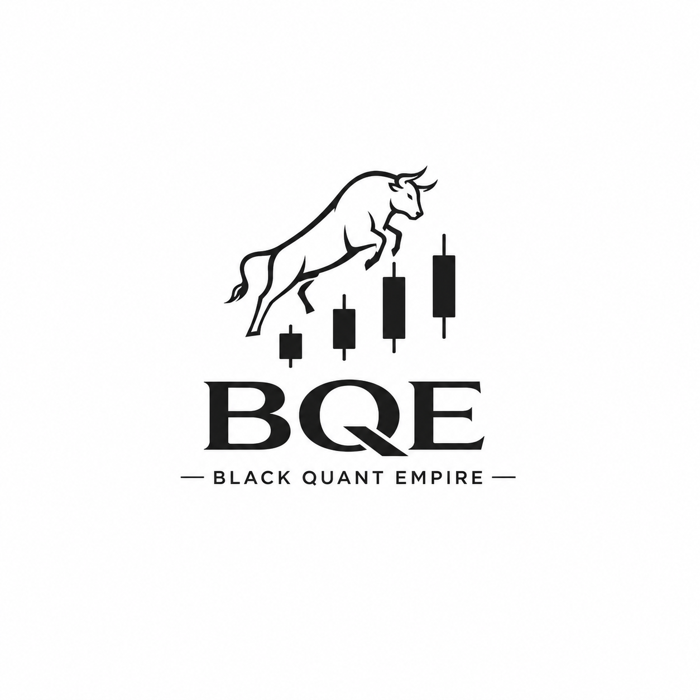

<div align="center">
  

# bqe-frontend

Website and research pages of **Black Quant Empire** — quantitative trading on Gold and
NASDAQ futures.

**Live:** https://bqe-frontend.pages.dev

</div>

---

This file documents the *frontend repository*: how it is laid out, the conventions each page
follows, and what to do when you add something. The company itself is described on the
site (`index.html`, `pages/about.html`, `pages/strategy.html`).

## How it is served

The site is a Cloudflare Worker serving static assets, connected directly to
this repository. Push to `main` and Cloudflare pulls, runs `./build.sh`, and
deploys `_site/` together with the Worker in `worker/` — live usually inside
a minute. Static files are served straight from the CDN; the Worker only runs
for `/api/*`, for the price and rundown data, and on its cron schedule. There
is no other server: this replaced `bqe-backend` (Azure Container Apps plus
GitHub Actions jobs).

```
visitor ─▶ Cloudflare ─┬─ static file ─────────────▶ _site/ (CDN)
                       ├─ /api/quotes/:symbol ──────▶ Worker ─▶ Yahoo (cached 60 s)
                       ├─ /api/contact ─────────────▶ Worker ─▶ D1
                       ├─ /api/auth/*, /api/state/* ─▶ Worker ─▶ D1 (accounts, saved work)
                       ├─ /api/market/* ────────────▶ Worker ─▶ Yahoo (Trading Journal)
                       └─ /research/*/data/*.json ──▶ Worker ─▶ D1, else the committed file
cron ──────────────────────────────────────────────▶ Worker ─▶ Yahoo · Wikipedia · Gemini ─▶ D1
```

There is no API token and no GitHub secret anywhere in this setup. Cloudflare
watches the repository through its GitHub App, so there is no credential to
store, leak or renew.

Pull requests and branches are built too, each to a preview URL of its own,
which Cloudflare posts as a check on the pull request. A change can therefore
be looked at on a real CDN before it reaches the production domain.

Consequences worth remembering:

- The **repository root is the site root**. Every path in the HTML is absolute
  against it — `/assets/css/shared.css` is `assets/css/shared.css` on disk — so a
  local preview must be served from the root (see [Local preview](#local-preview)),
  and opening a page as a `file://` URL shows it unstyled.
- Repository furniture never reaches the CDN. `build.sh` leaves out `.git`,
  `.github/`, `.gitignore`, `docs/`, `README.md`, `wrangler.toml`, the
  Worker's source (`worker/`, `migrations/`, `test/`, `package.json`) and itself,
  so adding documentation here cannot bloat the site. This matters more than
  it looks: publishing the root would push `.git` at Cloudflare, and a pack
  file over 25 MiB fails the deploy outright.
- All server-side code is in `worker/` (see [The Worker](#the-worker)). Its
  data lives in a Cloudflare D1 database called `bqe`.
- `_headers` at the root sets the security and caching headers Cloudflare
  applies to static files. Responses the Worker builds itself get the same
  security headers from `worker/http.ts`, since `_headers` does not reach them.

## Repository layout

The repository root **is** the site root: everything here is served, except the
handful of things `build.sh` leaves out.

```
├── README.md               This file (not published)
├── _headers                Security and caching headers Cloudflare applies
├── docs/
│   └── DEPLOYMENT.md       Cloudflare setup, secrets, custom domain
├── wrangler.toml           Worker config: assets, D1 binding, cron schedule
├── worker/                 The Worker: API, data serving, scheduled jobs
│   └── news/               Market News: feeds, briefing, calendar, chat
├── migrations/             D1 schema, applied by wrangler
├── test/                   Worker unit tests (vitest)
├── package.json            Worker tooling (wrangler, typescript, vitest)
├── build.sh                Assembles _site/ — what Cloudflare publishes
├── .github/workflows/
│   └── ci.yml              Link check, Worker typecheck/tests/bundle
│
├── index.html              Start page (market-network hero, formula-network band)
│
├── pages/                  Every other top-level page
│   ├── about.html          Über uns — brand and trademark documentation
│   ├── strategy.html       Trading strategy
│   ├── careers.html        Open roles
│   ├── contact.html        Contact form
│   ├── accessibility.html  WCAG / WZG accessibility statement
│   ├── disclaimer.html     Risk disclaimer
│   ├── impressum.html      Austrian Impressum
│   ├── privacy.html        Privacy policy
│   ├── license.html        Licences of third-party material
│   ├── credits.html        Media sources
│   └── admin.html          Admin terminal: accounts and AI access (admins only)
│
├── components/             HTML fragments injected at runtime
│   ├── header.html         Logo, login button, primary navigation
│   └── footer.html         Footer links, legal links, year
│
├── assets/
│   ├── css/
│   │   ├── shared.css      Design tokens + every shared component
│   │   └── pages/*.css     One stylesheet per page, loaded after shared.css
│   ├── js/
│   │   ├── components.js   Injects header/footer, sets aria-current, fills the year
│   │   ├── navigation.js   Burger menu + its nav wave + login modal
│   │   ├── hero-network.js Start page hero animation (canvas)
│   │   ├── formula-network.js Start page formula band animation (canvas)
│   │   ├── research-hero.js  Research intro band animation (canvas)
│   │   ├── research-graph.js Research project graph, list view and search
│   │   ├── session.js      Sign-in, sign-up and per-user saving, shared by site and apps
│   │   ├── admin.js        The admin terminal (pages/admin.html)
│   │   └── form.js         Contact form validation (WCAG error handling)
│   ├── images/             Page imagery, each as .webp + .jpg/.png fallback
│   ├── captions/de.vtt     Captions for assets/video.mp4
│   └── video.mp4           Unused since the "Was wir tun" section was replaced
│
└── research/               One folder per project, plus the index over them
    ├── index.html          Research index (project graph / list)
    ├── RESEARCH_PAPER_STYLE_GUIDE.md  How a write-up is styled
    ├── bqe-decomp/         Binary encoding for 1-minute OHLCV data
    │   ├── index.html
    │   └── utils/*.png     Its figures
    ├── marketjepa/         Self-supervised world model
    │   └── index.html
    ├── tradingjournal/     Trade log, chart markup and journal (own README)
    ├── markettape.html     Write-up for Market News (replaced Market Tape)
    ├── markettape/         The Market News page (own README)
    ├── historymap/         Interactive history atlas (own README)
    └── stack/              S&P 500 chart feed (own README)
        ├── index.html
        ├── live.example.json  Template for pointing live quotes elsewhere
        └── data/*.json     Last committed snapshot; D1 serves fresher copies
```

The fetchers and the live-quotes service are in `worker/`; the Python versions
in [`bqe-backend`](https://github.com/SchwarzRene/bqe-backend) are retired.

**Why the research projects are all folders.** `assets/js/research-graph.js`
lists BQE-DeComp, MarketJEPA, HistoryMap, Market News and Stack as five equal
projects — the graph, the list and the search treat them the same way, and the
layout on disk says what the site already said.

## How a page is put together

Every page under `pages/` follows the same skeleton. The header and footer are **not** in the
HTML — `components.js` fetches them and replaces the placeholder divs, so a navigation
change is made once in `components/header.html` and applies everywhere.

The header carries three links — Startseite, Research, Kontakt. Über uns, Karriere and
Handelsstrategie are all reachable from the footer, which is where the pages a visitor
looks up rather than navigates to belong. Below 768px those three links become the
burger menu, and `initNavWave()` in `navigation.js` threads a slim signal trace down
its left gutter: the path is built from the links' **measured** positions, never from
guessed coordinates, so it keeps fitting whatever the menu holds, and the node on the
current page is gold rather than blue.

```html
<!DOCTYPE html>
<html lang="de">
  <head>
    <meta charset="UTF-8" />
    <meta name="viewport" content="width=device-width, initial-scale=1.0" />
    <meta name="description" content="…" />
    <title>Seitenname - Black Quant Empire</title>

    <link rel="stylesheet" href="/assets/css/shared.css" />
    <link rel="stylesheet" href="/assets/css/pages/seitenname.css" />
    <link rel="icon" href="/assets/images/logo.png" type="image/png" />
  </head>

  <body>
    <a href="#main-content" class="skip-link">Zum Hauptinhalt springen</a>
    <div id="header-placeholder"></div>

    <main id="main-content">
      <section class="hero seitenname-hero">
        <div class="container text-center">
          <h1>Seitenname</h1>
          <p class="lead">Ein Satz, der die Seite einordnet.</p>
        </div>
      </section>

      <!-- content sections -->

      <nav class="page-navigation" aria-label="Seitennavigation">
        <a href="/pages/vorherige.html" class="btn btn-secondary btn-prev">← Vorherige</a>
        <a href="/pages/naechste.html" class="btn btn-secondary btn-next">Nächste →</a>
      </nav>
    </main>

    <div id="footer-placeholder"></div>
    <script src="/assets/js/components.js"></script>
    <script src="/assets/js/navigation.js"></script>
    <!-- cookie banner markup -->
  </body>
</html>
```

### Conventions these pages keep to

| Area | Rule |
|---|---|
| Language | Content is German, `lang="de"`. Code comments and these docs are English. |
| Headings | Exactly one `<h1>` per page, in the hero. Sections use `<h2>`, subsections `<h3>` — never skip a level. |
| Title | `Seitenname - Black Quant Empire` |
| Styling | Colours, spacing, type sizes come from the `:root` tokens in `shared.css`. Use `var(--space-4)`, not `16px`. |
| Overlays | A translucent overlay or glow uses the channel triplets — `rgba(var(--rgb-gold), 0.2)`, `--rgb-navy`, `--rgb-black` — so it follows the palette instead of pinning the colour it was written against. `rgba(0,0,0,…)` shadows are fine as they are. |
| Page CSS | One file per page in `assets/css/pages/`, loaded *after* `shared.css`; page-specific rules live there, not in a `<style>` block. |
| Accessibility | Skip link, `aria-label` on every `<nav>`, alt text on every image, visible focus. The site publishes an accessibility statement — keep it honest. |
| Images | Ship `.webp` plus a `.jpg`/`.png` fallback of the same name, and set `loading="lazy" decoding="async"` below the fold. |

## Adding to the site

### A new page

1. Copy the skeleton above into `pages/neueseite.html`.
2. Create `assets/css/pages/neueseite.css` and link it. Even if it starts empty, the
   page then has a home for its own rules.
3. Add it to the navigation in `components/header.html` — and, if it belongs there, to
   `components/footer.html`. Both are shared, so this is the only place to edit.
4. Wire the `page-navigation` prev/next links on the neighbouring pages so the chain
   stays intact.
5. Copy the cookie banner markup from an existing page.
6. Check it at 1440px, 768px and 390px before pushing.

### A section on an existing page

Add a `<section>` inside `<main>`, wrap the content in `<div class="container">`, and
start it with an `<h2>`. `shared.css` handles the vertical rhythm, the divider and the
alternating background.

> **Careful with `<article>` pages.** `shared.css` makes `article section` full-bleed
> (`width: 100vw` with a negative margin) so long documents like `pages/privacy.html` can span
> the viewport. If your article sits inside a narrower column, you must neutralise that
> — `about.css` shows how (`.about-text-side section { width: 100%; margin-left: 0; }`).

### An image or a video

- Images go in `assets/images/` as a `.webp` plus a `.jpg`/`.png` fallback.
- Video is committed to the repository, so encode before adding — a phone should not
  download a 1080p master:

  ```bash
  ffmpeg -i source.mp4 -an -vf "scale=1280:720:flags=lanczos" \
    -c:v libx264 -preset slow -crf 28 -pix_fmt yuv420p -movflags +faststart \
    assets/beispiel.mp4
  ```

  `-an` drops the audio (a background video must be silent anyway — browsers only
  autoplay muted video) and `+faststart` moves the index to the front so playback can
  begin before the file finishes downloading. Keep the source frame rate: resampling
  30 fps to 25 duplicates frames unevenly and judders. Also export a poster frame to
  `assets/images/` for the loading state and for `prefers-reduced-motion`.
- **When you replace a media file or a stylesheet in place, bump its version query**
  (`video.mp4?v=2`, `home.css?v=3`). Browsers and the Pages CDN cache these aggressively;
  without a new URL, phones keep serving the old file.

### The start page hero

The hero is a canvas animation (`assets/js/hero-network.js`), not a video: nodes are
quotes that tick on their own schedule and expire when they reach zero, over a price
line following an Ornstein-Uhlenbeck process.

Three things to keep intact when touching it:

- It sizes itself to the `.hero` element, not the viewport, and re-fits through a
  `ResizeObserver`. Nothing in it may assume `window.innerWidth`.
- Its keep-out ellipse is measured from the `.hero-content` box, so nodes bounce off
  the headline instead of drifting behind it. Change the copy freely — the zone
  follows. Add a layer of your own and give it a positive `z-index`; the canvas,
  vignette and grain occupy 0 and 1.
- It only runs while the hero is on screen and the tab is visible (`IntersectionObserver`
  plus `visibilitychange`), and under `prefers-reduced-motion` it paints one static
  frame and never starts the loop.
- `hero-rise` animates **transform only**. Opacity is deliberately absent from both the
  elements and the keyframes: a base `opacity: 0`, or a from-state pinned by `fill-mode`
  backwards, leaves the headline invisible whenever the animation does not advance —
  which is exactly how the hero copy used to disappear. Do not reintroduce an opacity
  fade here.
- A click is a trade at that point: an expanding ring brightens the edges it sweeps
  over, and nearby vertices take a burst of ticks in one direction, a beat apart. The
  listener is on `.hero`, not the canvas, so clicks over the headline count too — and
  because nodes are drawn under an ambient camera translate, the click is put back into
  node space (`lastCam`) before it is matched against them. The formula band below
  shares this behaviour.
- Its colours are written literally in `hero-network.js` and mirrored by the `.hero`
  fallback gradient in `home.css`, deliberately: the canvas cannot read CSS tokens, and
  the two must agree. They are where the site's palette came from — change them and the
  tokens in `shared.css` together, or the page splits into two colour schemes.

### The research index

`research/index.html` is two canvases and a set of links. The band behind the heading
runs the start page's own market network (`assets/js/research-hero.js`); below it,
`assets/js/research-graph.js` draws one soft cloud per category and lays the projects
over it as real `<a>` elements — focusable, linkable, readable by a screen reader.
Only the clouds and the category names are painted; nothing you can click is canvas.

- **`PAPERS` in `research-graph.js` is the index.** Adding an entry there adds the
  project to the graph, the list and the search at once. The no-script list in
  `research/index.html` carries the same five projects, and the footer its own copy —
  all three are updated together.
- **Graph and list are one set of nodes in two layouts.** Each node is a small physics
  body: a spring pull toward whatever its current mode wants, damped so it settles,
  bouncing off its neighbours on the way. The toggle changes the target, not the
  markup.
- Each rock is generated from its project's `id`, so a project keeps the same
  silhouette across reloads; the same seed drives its spin direction and period.
- Under `prefers-reduced-motion` nothing orbits: nodes land on their target
  immediately and the animation loop never starts.
- The intro canvas needs an explicit `width`/`height` in CSS. `inset: 0` alone anchors
  a replaced element at its intrinsic size — the backing store, which is
  `devicePixelRatio` times larger — and the whole mesh then draws at double scale on a
  phone.

### The start page formula band

Below the hero, `.formula-network` is a second canvas animation
(`assets/js/formula-network.js`). It replaced the old "Was wir tun" section: the focus
list it carried lives in full on `pages/strategy.html`, and the risk warning it ended with is
in the site-wide footer, so nothing moved out of reach.

Formulas are generated from templates in `LINE_TEMPLATES`, not drawn from a fixed list —
add a template and it joins the rotation. Behind them runs the same mesh as the hero,
with a shared market regime (calm, bull, bear, crash) biasing every node's tick at once.

It follows the same rules as the hero — sizes to its section rather than the viewport,
re-fits through a `ResizeObserver`, runs only while on screen and visible, and paints a
single frame under `prefers-reduced-motion`. Two things are its own:

- A click here also shoves nearby formulas outward, on top of the ripple and tick burst
  the hero does. As in the hero, the listener is on the section and the canvas is
  `pointer-events: none`. Anything layered over it needs a positive `z-index`: the
  canvas sits at 0 and `.formula-content` at 2. Nothing announces the interaction —
  the band carries no hint line, so a click is there to be found.
- It has **no** keep-out zone, unlike the hero. Its copy is set left and in grey —
  informative text, not a title — on a `.formula-copy` panel in the hero's own ground
  colour (`--color-black` / `#050810`), and that panel carries the contrast instead, so
  the artwork runs behind it untouched.
- The panel sits half a gutter outboard of the site's content column on screens from
  1024px, and rides near the top of the band rather than its middle below 768px, where
  the section is tall relative to the copy.
- Each sentence is one line (`white-space: nowrap` on `.formula-lead` and
  `.formula-sub`); their `clamp()` sizes are tuned so neither wraps or overflows down to
  320px. Give the two lines their own classes rather than styling `.formula-copy > p` —
  that selector outranks `.formula-sub` and silently flattens both to one size.
- Its gradient starts on the hero's ground and climbs to the lighter blue, in both
  `drawBackground()` and the `.formula-network` CSS fallback; the two must agree. A
  `.band-divider` of pure black separates it from the hero, since both canvases meet
  on `#050810` and would otherwise run together. It repeats the `border-bottom` that
  `shared.css` puts on every `<section>`, so the black band is framed by the same rule
  top and bottom — the divider is a `<div>` and would not get one otherwise. Nodes bounce off it; formulas fade down as they cross it rather than
  sitting behind the words, and `FLOATER_PAD` widens it for them alone, since a formula
  is anchored at its left edge but runs a long way right of it. Change the copy freely —
  the zone follows.
- Floater count and type size follow the canvas area (`measureDensity`), so a phone gets
  a legible scattering instead of a desktop's worth of formulas. A wide canvas lands back
  on the reference numbers: 30 floaters, line sizes up to 26px.

### A research project

Work goes in its own folder under `research/`, with an `index.html` and, if it
carries tooling or data of its own, a short `README.md` (see
`research/historymap/`). That holds for a plain write-up too:
`bqe-decomp/index.html` and `marketjepa/index.html` are single documents in a folder of
their own, which is what keeps their figures beside them (`bqe-decomp/utils/`) and their
URL a clean `/research/bqe-decomp/`. A paper is styled from its own embedded CSS rather
than `shared.css` — `research/RESEARCH_PAPER_STYLE_GUIDE.md` is the reference
for that, and for redesigning the write-ups that still predate it. List every project in
three places, which are meant to agree: the `PAPERS`
array in `assets/js/research-graph.js` (the graph, the list and the search all read it),
the `<noscript>` list in `research/index.html`, and the Research column of the footer.
A new category also needs a cluster centre in `CLUSTER_CENTERS`, an entry in `COLORS`
and a swatch in the page's legend.

### A page that needs live data

Everything dynamic goes through the Worker. Two patterns, depending on how
fresh the data has to be:

**Refreshed on a schedule, stored in D1** — what `research/stack/` and
Market News (`research/markettape/`, `worker/news/`) do:

1. Write the job as a function in `worker/` that fetches, shapes and stores
   JSON (`putDocument()` in `worker/stack.ts` for a single document, or a
   table of its own via a new file in `migrations/`).
2. Add a cron expression to `[triggers]` in `wrangler.toml` and a `case` for
   it in `scheduled()` in `worker/index.ts`.
3. Serve it at the path the page reads, and add that path to
   `run_worker_first`. Fall back to `env.ASSETS.fetch(request)` so a committed
   copy covers the time before the first run.

**Fresh on load** — add a route under `/api/` in `worker/index.ts`, as
`/api/quotes` does for live bars. Browsers cannot call Yahoo directly (no
CORS headers), which is why this lives on the Worker. Cache upstream answers
with `caches.default`, and give the page a short deadline and a fallback so a
slow upstream degrades to stored data rather than an error.

## The Worker

| Path | Source | What it does |
|---|---|---|
| `GET /api/health` | `worker/index.ts` | Liveness; the Stack page probes it to find the API. |
| `GET /api/quotes/:symbol` | `worker/yahoo.ts` | Daily + hourly bars from Yahoo, cached 60 s at the edge. |
| `POST /api/contact` | `worker/contact.ts` | Stores a contact form submission in D1 (validated, rate-limited, honeypot). |
| `GET /research/stack/data/*.json` | `worker/stack.ts` | Prices from D1; the committed file until D1 has them. |
| `GET /api/news` | `worker/news/index.ts` | Market News: the latest briefing, 24 h of headlines, this week's calendar. |
| `POST /api/news/refresh` | `worker/news/index.ts` | Fetch now and write a fresh briefing. AI access; one per 15 min. |
| `POST /api/chat` | `worker/news/chat.ts` | Market News chat (Gemini). AI access; daily limit per user. |
| `GET/POST /api/company/analysis` | `worker/news/analyst.ts` | Market News AI analyst note. AI access; same daily limit. |
| `POST /api/admin/run/{stack,news,calendar,briefing}` | `worker/index.ts` | Runs a job now. Needs `Authorization: Bearer $ADMIN_TOKEN`. |
| `POST /api/auth/{signup,login,logout,password}`, `GET /api/auth/me` | `worker/auth.ts` | Sign-up and sign-in with an HttpOnly session cookie. |
| `GET /api/admin/users`, `PATCH/DELETE /api/admin/users/:id`, `POST /api/admin/users/:id/password` | `worker/admin.ts` | The admin terminal: list accounts, grant/revoke AI access, suspend, change role, reset a password, delete. Signed-in admins only. |
| `GET/PUT /api/state/{stack,journal,news}` | `worker/state.ts` | A signed-in user's saved work, one JSON document per app. |
| `GET /api/market/{quote,candles}` | `worker/market.ts` | Yahoo quotes and candles for the Trading Journal, cached at the edge. |

### Accounts and saved work

Visitors can use every research app without an account, but **nothing a
guest does is stored** — not on the server and not in their browser. It
lives in the open tab and is gone on reload. A signed-in user's work in
Stack (marked charts, drawings, theories) and in the Trading Journal is
saved to their account and follows them to any device. So do their
display settings — Market News's regions, time zone, headline sort and
calendar filters, the Trading Journal's light/dark theme and the History
Map's language: one `prefs` document per user with a section per app
(`PATCH /api/state/prefs`, merged rather than versioned, via
`BQE.prefs.sync/save` in `session.js`). Each app also keeps them in
`localStorage`, so guests keep theirs in the browser. Market News's Ask
AI conversations are saved to the account too (`GET/DELETE /api/chats`),
with a history to reopen or delete them.

Anyone can create an account (Login → *Create one*): a username (3–32
letters, digits, `. _ -`), a password of at least 8 characters and,
optionally, an email address. Sign-ups are limited to 5 per visitor per
day.

**AI access is off by default.** A new account can save its work, but the
AI features — Market News's Ask AI chat, the AI analyst note and a fresh
briefing on Refresh — answer `403` until an admin grants access. Admins
always have it. The check is on the Worker (`aiDenied` in
`worker/auth.ts`), before any model call.

**The admin terminal** is `/pages/admin.html`, linked from the account
panel for admins. It lists every account (email, role, AI access, status,
created, last sign-in, open sessions, AI requests today) and has a switch
per user for AI access, plus suspend (which also signs them out), make
admin / demote, reset password (shows a temporary one to pass on) and
delete. The same actions work as commands at its prompt — `grant alice
bob`, `revoke alice`, `grant-all`, `suspend`, `promote`, `reset`, `list
noai`, `whois`; `help` lists them. An admin cannot suspend, demote or
delete their own account.

The first admin is `ceo`, created by `migrations/0002_users.sql` and made
admin by `migrations/0004_accounts.sql`. Its starting password is weak and
its hash is in this public repository: change it after the first sign-in
(Login → Change password), which also signs out every other session. To
make another account admin from the command line:
`npx wrangler d1 execute bqe --remote --command "UPDATE users SET role = 'admin' WHERE username = 'NAME'"`.

An app opts in with `/assets/js/session.js`: `BQE.store("<app>")` loads and
saves its document (a no-op for guests), and `BQE.mountAccountChip(el)`
shows who is signed in. A new app also needs its name added to `APPS` in
`worker/state.ts`.

## Data and automation

| Cron (UTC) | Job | Writes to D1 |
|---|---|---|
| every 3 min, 22:00–23:59, Mon–Fri | Stack prices: constituents from Wikipedia, bars from Yahoo, 20 tickers a run | `tickers`, `series` |
| every 15 min | Market News (`worker/news/`), one job per run: headlines (a third of the sources per run); Gemini briefings at 02:30, 08:00, 12:30, 16:30 New York time on weekdays and Sat 10:00; calendar results at :15 on weekdays; the calendar (no model calls) at 05:00 and 05:30 New York time, with the daily clean-up | `news_*`, `documents` |
| with the 05:00 run | Deletes contact messages 30 days after they were answered, expired sessions | `contact_messages`, `sessions` |

The Stack job is batched because one Worker invocation may make only a
limited number of outbound requests: each run takes the next tickers not yet
refreshed today, and a failed ticker is retried 20 minutes later. It is also
incremental: a ticker already in D1 fetches only its last month of days and
five days of hours and appends them. The full 10-year download happens only
when the stored history no longer matches (a dividend or split), when there
is a gap, or on that ticker's roughly monthly full check.

Nothing is committed back to git any more. The data files still in
`research/stack/data/` are the last snapshot and only matter until D1 has
filled in — the index switches to D1 once it holds prices for 90% of the list.

Checks for the Worker: `npm test` (unit tests), `npm run typecheck`.

## Local preview

Serve the repository root — it is the site root, and an absolute path like
`/assets/css/shared.css` only resolves from there:

```bash
python3 -m http.server 8000
# → http://localhost:8000/index.html
```

A plain file server is enough — and it is *required*, because the pages use
absolute paths and `components.js` fetches the header and footer over HTTP.

To run the Worker too — API, D1 and all — against a local database:

```bash
npm install
npx wrangler d1 migrations apply bqe --local
npm run dev                                  # → http://localhost:8787
curl "localhost:8787/__scheduled?cron=*/3+22-23+*+*+1-5"   # fire the Stack job
curl "localhost:8787/__scheduled?cron=*/15+*+*+*+*"        # fire the Market News tick
```

For the Market News briefing and chat locally, put `GEMINI_API_KEY=...` in `.dev.vars` (git-ignored).

## Deploying

Push to `main`. Cloudflare builds, deploys the Worker and applies any new D1
migrations. The only secrets are the Gemini key and the admin token, both
stored on the Worker, never in git.

Full setup — the Cloudflare project, the two API secrets, the custom domain —
is in **[docs/DEPLOYMENT.md](docs/DEPLOYMENT.md)**.

