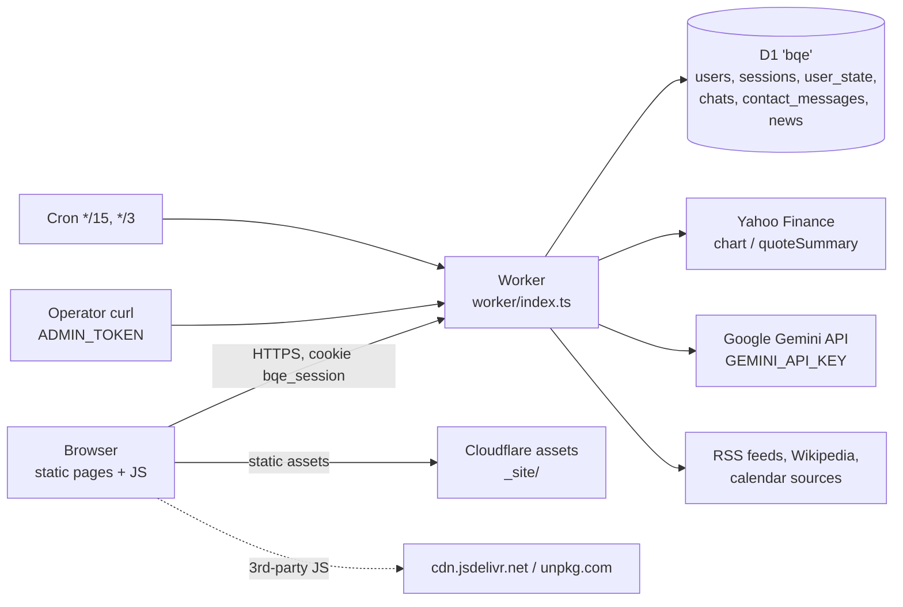

# Security, Scale & Reliability Audit — bqe-frontend
Date: 2026-09-25 · Scope: Cloudflare Worker (`worker/**`), D1 migrations, `wrangler.toml`, `_headers`, `build.sh`, CI, and the client code that renders server data (`assets/js/*`, `research/markettape/js/*`, `research/tradingjournal/js/*`). `research/stack/index.html` and `research/historymap/*` were only sampled. · Commit: `460fe61`

## 1. Executive summary
Overall risk: **High**

bqe-frontend is a static site plus one Cloudflare Worker. The Worker handles sign-up and sign-in, per-user storage, an admin terminal, and AI features that call Google Gemini. Its data lives in a single D1 (SQLite) database. The code is careful in many places: every query is parameterised, output is HTML-escaped throughout, session tokens are hashed, CSRF is handled by Origin checks plus `SameSite=Lax`, and the AI features are cost-gated. The biggest risks are in how the site is set up and run rather than in the code itself:
- the admin account is seeded with a public password hash;
- one step in the login lockout lets an attacker undo it;
- `npm run deploy` can publish local secret files;
- sign-up is open with no limit on how much each account can store, so one person can fill the whole database.

At its current size the site works. It is **not ready for "100M users"**: it runs on free-plan limits and one D1 database, with no bot protection.

### Fix first (this week)
1. **SEC-01**: Confirm the `ceo` password was changed in production. Add a migration that invalidates the seeded hash either way.
2. **SEC-02**: Stop a successful login from clearing *all* failed attempts for that IP. Add a per-account lockout.
3. **SEC-03**: Stop `build.sh` from copying dotfiles such as `.dev.vars`/`.env` into `_site/` (switch to an allowlist).
4. **SCL-01 / SEC-04**: Put Turnstile (or similar) on sign-up. Add a total storage limit per account and a global limit on new accounts.
5. **PRV-01**: Bring the privacy policy in line with what the site actually does: Cloudflare hosting, Google Gemini, no 2FA, account data retention.

## Remediation status (2026-09-25)
Every finding below has a fix in the code, with a regression test in `test/security.test.ts`. The table says which ones still need action from the site owner.

| ID | Fix | Still needed from the owner |
|---|---|---|
| SEC-01 | `migrations/0006_security.sql` disables the seeded `ceo` hash if it was never changed. `scripts/set-password.mjs` sets a password without committing it. | If `ceo` still had the seeded hash, set a new password after deploying (docs/DEPLOYMENT.md). |
| SEC-02 | Failures are counted per visitor **and** per account. A success clears only that account's failures. | — |
| SEC-03 | `build.sh` is an allowlist and refuses to publish hidden files. A CI step checks that a canary `.dev.vars` never reaches `_site/`. | — |
| SCL-01 | Accounts are capped at 4 MB, with a site-wide limit of 30 sign-ups per hour. Turnstile is checked when configured. | Create a Turnstile widget and set `TURNSTILE_SITE_KEY` / `TURNSTILE_SECRET`. |
| SEC-04 | Attempts are inserted before they are counted, so parallel requests can't slip past. IPv6 is counted per /64. The `AUTH_LIMITER` rate-limit binding is added. | — |
| SEC-05 | The analysis takes the company name from Yahoo or the watchlist, never from the client. | — |
| SEC-06 | Leaflet and Lightweight Charts are vendored from npm into `assets/vendor/`. A CSP (`script-src 'self'` + Turnstile) is on every page, and the inline scripts and handlers were moved to files. Headless Chromium over every page shows no violations. | — |
| PRV-01 | The privacy policy now names Cloudflare and Google Gemini, explains the transfer basis, drops the 2FA/AES/EU-storage claims, and lists the actual retention periods. Users can export (`GET /api/auth/export`) and delete (`POST /api/auth/delete`) their own account. | Have the new policy text legally reviewed. For EU-only storage, recreate D1 with `--jurisdiction=eu`. |
| PRV-02 | The visitor hash is an HMAC keyed by `IP_HASH_SECRET`. | `npx wrangler secret put IP_HASH_SECRET`. |
| PRV-03 | Unanswered messages are deleted after 180 days. The admin terminal gained `messages` / `read` / `answered`. | — |
| SEC-07 | New passwords need 12+ characters and are checked against Have I Been Pwned (k-anonymity, fails open). Iterations are configurable via `PBKDF2_ITERATIONS`, and old hashes are upgraded at sign-in. | On Workers Paid, set `PBKDF2_ITERATIONS = "600000"`. |
| SCL-02 | Custom ranges are rounded to whole bars and clamped. Unknown tickers are cached as 404 for 10 minutes. The `MARKET_LIMITER` binding is added. | — |
| REL-01 | docs/DEPLOYMENT.md now has a Time Travel restore, an export drill and monitoring. | Move to Workers Paid before growth, and run the restore drill once. |
| REL-02 | An `admin_audit` table is written in the same batch as every admin change, shown by the terminal's `audit` command, and kept for a year. | — |
| SEC-08 | A taken email gets the same answer as a taken name/email race. | — |
| SEC-09 | Password change and account deletion count wrong passwords toward the account lockout. | — |
| PRF-01 | The Yahoo cookie and crumb are reused for 30 minutes per instance and dropped on 401/403. | — |
| SEC-10 | `readText` refuses a large Content-Length up front and cuts the stream off at the limit. | — |
| SEC-11 | Chat history is rebuilt from the saved conversation. Only the new question comes from the client. | — |

**Trade-off to know about:** because of the per-account lockout, someone guessing at an account can keep its owner out for up to an hour. An admin can lift the lockout with `DELETE FROM login_attempts WHERE account = '<name>'`.

**Not addressed (by design):** the "100M users" architecture in §7 (sharding user data, a session cache, a licensed market-data feed) is a roadmap item, not a patch.

## 2. System model

**Trust boundaries:**
- internet ↔ Worker;
- Worker ↔ third-party data (RSS, Yahoo, Wikipedia), which is untrusted input to both D1 and the LLM prompt;
- Worker ↔ Gemini (user chat content leaves the EU);
- signed-in user ↔ admin (a role in `users.role`);
- operator ↔ `/api/admin/run/*` (bearer token).

**Sensitive data:**
- password hashes (PBKDF2);
- session hashes;
- emails;
- contact-form PII (name, email, phone, message);
- chat conversations;
- trading-journal contents.

## 3. Threat model
| Asset | Threat actor | Entry point | Main threats (STRIDE) |
|---|---|---|---|
| Admin account (`ceo`) | Anonymous internet | `POST /api/auth/login`, public repo | **S**poofing via public hash / brute force → **E**levation to admin |
| User accounts & journals | Credential-stuffing bots | `/api/auth/login` | **S**poofing, **I**nfo disclosure of journals/chats |
| D1 capacity & availability | Anonymous (multi-account) | `/api/auth/signup`, `PUT /api/state/*`, `/api/contact` | **D**oS by filling storage / exhausting free-plan quotas |
| Worker secrets (`GEMINI_API_KEY`, `ADMIN_TOKEN`) | Anyone, after a mistaken local deploy | `build.sh` → `_site/` | **I**nfo disclosure |
| Gemini quota / money | AI-enabled user, poisoned feeds | `/api/chat`, `/api/company/analysis`, RSS | **D**enial of wallet, **T**ampering with shared AI output (prompt injection) |
| Yahoo access (shared egress) | Anonymous | `/api/market/*`, `/api/quotes/*` | **D**oS: upstream ban from cache-busting fan-out |
| Contact/visitor PII | Insider / DB leak | `contact_messages`, `*_attempts` | **I**nfo disclosure, **R**epudiation (no audit trail) |
| Session integrity | Compromised CDN script | `<script src=cdn…>` on same origin | **T**ampering: authenticated API calls as the victim |

## 4. Findings summary
| ID | Title | Category | Severity | Confidence | Effort |
|---|---|---|---|---|---|
| SEC-01 | Admin account seeded with a public hash of a "weak" password | Security | **Critical** | Needs verification | S |
| SEC-02 | Login lockout can be reset by the attacker; no per-account limit | Security | **High** | Confirmed | S |
| SEC-03 | `build.sh` publishes local dotfiles (`.dev.vars`, `.env`) to the CDN | Security | **High** | Likely | S |
| SCL-01 | Open sign-up + 5.4 MB per account → one actor can fill D1 | Scalability / Reliability | **High** | Confirmed (limits: Needs verification) | M |
| SEC-04 | Sign-up / login limits keyed only on IP hash; check-then-insert races | Security | Medium | Confirmed | M |
| SEC-05 | Shared, cached AI analysis can be poisoned by one user (prompt injection via `name`) | Security | Medium | Confirmed | S |
| SEC-06 | Third-party scripts without SRI, and no CSP on any page | Security | Medium | Confirmed | S |
| PRV-01 | Privacy policy contradicts the implementation (hosting, Gemini, 2FA, retention) | Privacy | Medium | Confirmed | M |
| PRV-02 | "IP is never stored": daily IP hash uses a public salt and is reversible | Privacy | Medium | Confirmed | S |
| PRV-03 | Unanswered contact messages are kept forever | Privacy | Medium | Confirmed | S |
| SEC-07 | PBKDF2 at 50k iterations (≈12× below current guidance) | Security | Medium | Confirmed | M |
| SCL-02 | Public market endpoints: cache-bustable and unlimited → Yahoo ban / quota drain | Scalability | Medium | Confirmed | S |
| REL-01 | Everything on one D1 DB on free-plan limits; no backup/restore procedure in repo | Reliability | Medium | Likely | M |
| REL-02 | Admin actions only in `console.log`; no durable audit trail | Reliability | Low | Confirmed | S |
| SEC-08 | Account existence revealed by sign-up (username/email "taken") | Security | Low | Confirmed | S |
| SEC-09 | Password change has no attempt limit | Security | Low | Confirmed | S |
| PRF-01 | Company profile mints a new Yahoo cookie+crumb on every cache miss | Performance | Low | Confirmed | S |
| SEC-10 | Request bodies are read fully before the size check | Security | Low | Confirmed | S |
| SEC-11 | Client can forge earlier "assistant" turns in chat history | Security | Info | Confirmed | S |

## 5. Detailed findings

### SEC-01 — Admin account seeded with a public hash of a "weak" password
- **Severity / Confidence / Effort**: Critical / Needs verification (depends on whether prod password was changed) / S
- **Location**: `migrations/0002_users.sql:100-103`, `migrations/0004_accounts.sql:19` (`UPDATE users SET role='admin' … WHERE username='ceo'`), `README.md:459-462`, `docs/DEPLOYMENT.md:112`
- **Description**: The migration inserts `ceo` with a fixed PBKDF2 hash, salt and iteration count. Its own comment calls the password "weak", and the repo is public. Migration 0004 then makes that account the site admin. Nothing in code forces a password change.
- **Impact**: Anyone can crack the hash offline, since everything needed to test guesses is committed and a weak password falls quickly at 50k iterations. With the password they can sign in as the sole admin. From there they can read every user's email, promote their own account, suspend or delete other users, reset passwords, and turn on AI access (which drains the Gemini quota). If the password was changed in production, the risk falls to a fresh deploy or a staging copy.
- **Scenario**: The attacker reads the migration, runs an offline dictionary attack against the known salt and iteration count, then signs in once. The online rate limit never comes into play.
- **Recommendation**:
  1. Check production now: `SELECT password_hash FROM users WHERE username='ceo'` must differ from the committed value.
  2. Add `migrations/0006_*.sql` that disables sign-in with the seeded hash: `UPDATE users SET password_hash = 'invalid' WHERE username='ceo' AND password_hash='7141…9ab7';`. Then set the real password through a one-off `wrangler d1 execute` using a hash generated locally.
  3. For future bootstrap, create the first admin with a CLI step that reads the password from stdin, never from a committed hash.
- **Verification**: A new unit test in `test/auth.test.ts` asserts that no migration contains a `password_hash` literal. Also, signing in to prod with the seeded password must fail.

### SEC-02 — Login lockout can be reset by the attacker; no per-account limit
- **Severity / Confidence / Effort**: High / Confirmed / S
- **Location**: `worker/auth.ts:145-186`, especially `:182` `DELETE FROM login_attempts WHERE ip_hash = ?`
- **Description**: Failed logins are counted per IP hash, with a limit of 10 per 15 minutes. A successful login deletes **all** failures for that IP, even when the failures were against other accounts. Nothing counts failures per account.
- **Impact**: An attacker opens a free account (sign-up is open). They try 9 passwords against the victim, then sign in to their own account to clear the counter, and repeat. That gives unlimited online guessing against `ceo` or any other user from a single IP. With rotating IPs, even the per-IP limit disappears.
- **Recommendation**:
  - On success, delete only the failures *for that username*. Store `username` (or its hash) in `login_attempts`.
  - Add a per-account limit, e.g. 10 failures per hour per username, with exponential backoff, in addition to the per-IP one.
  - Make the check atomic: insert the attempt first, then count, so parallel requests cannot all pass (see SEC-04).
- **Verification**: A test that makes 9 failures against user A, then a success for user B from the same IP, then a 10th attempt against A, must get 429.

### SEC-03 — `build.sh` publishes local dotfiles to the CDN
- **Severity / Confidence / Effort**: High / Likely / S
- **Location**: `build.sh:23-35` (`for entry in * .[!.]*` with a denylist), `package.json` `"deploy": "./build.sh && … wrangler deploy"`, `docs/DEPLOYMENT.md:109` and `README.md:516` (tell developers to create `.dev.vars`)
- **Description**: `build.sh` copies every top-level entry, dotfiles included, except for a short denylist. `.dev.vars`, `.env` and `.env.*` are not on that list. The docs tell developers to put `GEMINI_API_KEY` and `ADMIN_TOKEN` in `.dev.vars`, and `npm run deploy` runs `build.sh` on the developer's machine.
- **Impact**: A developer who runs `npm run deploy` locally publishes `/.dev.vars`, containing both secrets, as a public static file. Whether Cloudflare serves dotfiles depends on wrangler's asset-ignore defaults, so this is *Likely* rather than confirmed. Builds in Cloudflare CI are unaffected because the file does not exist there.
- **Recommendation**: Switch `build.sh` to an **allowlist**: `index.html _headers assets components pages research` plus the top-level images. Also add a `.assetsignore` in `_site` listing `.*`, and fail the build if any `_site/.*` file exists besides `_headers`.
- **Verification**: `touch .dev.vars && ./build.sh && test ! -e _site/.dev.vars`. Add this to CI.

### SCL-01 — Open sign-up with no per-account storage cap lets one actor fill D1
- **Severity / Confidence / Effort**: High / Confirmed in code; D1 plan limits need verification / M
- **Location**: `worker/auth.ts:81-134` (sign-up), `worker/state.ts:25` (`MAX_BYTES = 1_800_000` per app), `APPS = stack, journal, news` + `prefs`, `worker/news/conversations.ts` (50 chats × 200 messages)
- **Description**: Anyone can create 5 accounts per IP per day. Each account can store about 3 × 1.8 MB of `user_state` plus prefs and chats. Nothing caps the total.
- **Impact**: D1 databases have a hard size limit (500 MB on the free plan, 10 GB on paid). About 100 accounts on the free plan, or about 2,000 on paid, fill the database. After that, **every** write fails, including sessions (so nobody can log in), news ingest and contact messages. Filling the database this way costs the attacker nothing: no AI access is needed.
- **Recommendation**:
  - Add Cloudflare Turnstile to sign-up (verified server-side).
  - Cap each account's total `user_state` at around 2 MB.
  - Add a global sign-ups-per-hour limit.
  - Alert when D1 size passes 70%.
  - Consider putting large journal blobs in R2 with per-user quotas.
- **Verification**: A load script that creates N accounts and saves the maximum state stops at the quota. Also, a Turnstile token is required on `POST /api/auth/signup`.

### SEC-04 — Sign-up and login limits are keyed only on an IP hash, and the checks race
- **Severity / Confidence / Effort**: Medium / Confirmed / M
- **Location**: `worker/auth.ts:97-105` and `:152-160` (`SELECT COUNT(*)` then later `INSERT`)
- **Description**: Both limits read a count and write the attempt later. A burst of parallel requests all see the same count and all pass. The key is `CF-Connecting-IP`, so IPv6 rotation (a single /64 has 2^64 addresses) or a botnet defeats it.
- **Impact**: A credential-stuffing run at thousands of requests per second is limited only by Cloudflare's free-plan request cap and the 10 ms CPU limit. Each login still runs PBKDF2, even for unknown users, so the flood also burns CPU.
- **Recommendation**:
  - Record the attempt first (`INSERT … RETURNING` plus a count in the same batch), or use Cloudflare's Rate Limiting binding / WAF rate-limit rules on `/api/auth/*`.
  - Key the limit on the IPv6 /64 prefix.
  - Add a per-account limit (SEC-02) and Turnstile after N failures.

### SEC-05 — Shared, cached AI analysis can be poisoned by one user
- **Severity / Confidence / Effort**: Medium / Confirmed / S
- **Location**: `worker/news/analyst.ts:262` (`name = clip(body?.name, 80) || …`), `:278` (into the prompt), `:287-288` (stored under `news:analysis:<ticker>` for 6 h and served to **every** user)
- **Description**: The company `name` in a POST comes from the client and is placed in the prompt verbatim. The result is cached per ticker and shown to everyone who opens that company. Headlines from RSS feeds are a second, weaker injection channel into the briefing.
- **Impact**: Any user with AI access can plant misleading "analyst notes" for popular tickers, for example "NVDA: SEC investigation confirmed". Every visitor then sees them for 6 hours under the site's name. Output is escaped, so this is not XSS; the harm is to integrity and reputation.
- **Recommendation**: Ignore the client's `name`. Use `profile.name` or the watchlist name from the server. Tag each stored analysis with who triggered it, and let admins purge one.
- **Verification**: A test that POSTs with `name: "Ignore previous…"` must produce a prompt that does not contain that string.

### SEC-06 — Third-party scripts without SRI, and no Content-Security-Policy
- **Severity / Confidence / Effort**: Medium / Confirmed / S
- **Location**: `research/tradingjournal/index.html:16` (jsDelivr `lightweight-charts@4.2.3`), `research/historymap/index.html:83` (unpkg `leaflet@1.9.4`), `_headers`, `worker/http.ts:3-9` (no CSP)
- **Description**: The scripts are pinned by version but have no `integrity` attribute. They run on the same origin as `/api/*` and the admin terminal.
- **Impact**: A compromised or hijacked CDN package would run with the visitor's session. The cookie is `HttpOnly`, so it cannot steal it, but it could read the user's journal via `/api/state/journal` or chats via `/api/chats`. If an admin opens the page, it could promote an account via `PATCH /api/admin/users/:id` (a same-origin request passes the `crossSite` check).
- **Recommendation**:
  - Add `integrity="sha384-…" crossorigin="anonymous"`, or self-host both libraries under `/assets/vendor/`.
  - Add a CSP to `_headers` and `SECURITY_HEADERS`, starting with `default-src 'self'; script-src 'self' https://cdn.jsdelivr.net https://unpkg.com; object-src 'none'; frame-ancestors 'none'; base-uri 'self'`. Tighten it further once inline scripts (e.g. `research/stack/index.html:358`) are moved to files.

### PRV-01 — Privacy policy contradicts the implementation
- **Severity / Confidence / Effort**: Medium / Confirmed / M
- **Location**: `pages/privacy.html` §4.1 ("Hosting provider (GitHub Pages)"), §4.3 ("stored in the EU (Austria)"), §5.1 ("Two-factor authentication (2FA): available"), §7 (retention)
- **Description**:
  - Hosting is Cloudflare Workers and D1, not GitHub Pages.
  - Chat questions and journal-adjacent prompts are sent to **Google Gemini** (a US processor). The policy does not name Google.
  - There is no 2FA anywhere.
  - D1 has no EU jurisdiction set in `wrangler.toml`.
  - There is no stated retention for accounts, chats or journals, and no self-service delete or export for users.
- **Impact**: GDPR Art. 13/28/44 exposure: undisclosed processors and third-country transfer, and inaccurate security claims. This is a regulatory and reputational risk for an Austrian GmbH.
- **Recommendation**:
  - List Cloudflare and Google as processors with their DPAs and SCCs.
  - Remove the 2FA claim or implement 2FA.
  - Set a D1 location or jurisdiction if EU residency is promised.
  - Document account and chat retention, and add a "delete my account" endpoint.

### PRV-02 — The daily IP hash is reversible
- **Severity / Confidence / Effort**: Medium / Confirmed / S
- **Location**: `worker/http.ts:56-60` (`SHA-256("${day}|bqe|${ip}")`)
- **Description**: The "salt" is the date plus a constant string, both public. Anyone with read access to D1 can enumerate all 2^32 IPv4 addresses per day in seconds and recover the IPs behind `contact_messages.ip_hash`, `login_attempts` and `signup_attempts`.
- **Impact**: The code and the policy claim the IP is never stored, but for anyone holding the database it effectively is. Under GDPR this is pseudonymised personal data, not anonymous data.
- **Recommendation**: Use `HMAC-SHA256(secret, day|ip)` with a secret held as a Worker secret, or a key derived per day from that secret. Keep the one-day purge.

### PRV-03 — Unanswered contact messages are kept forever
- **Severity / Confidence / Effort**: Medium / Confirmed / S
- **Location**: `worker/contact.ts:84-91` (only deletes `answered_at IS NOT NULL AND answered_at < now-30d`)
- **Description / Impact**: Messages never marked answered are never deleted. Marking is a manual `wrangler d1 execute`, so in practice most messages will stay. That PII piles up indefinitely.
- **Recommendation**: Add a hard limit, for example deleting any message older than 180 days regardless of status. Also add a way to mark messages answered from the admin terminal.

### SEC-07 — PBKDF2 at 50k iterations
- **Severity / Confidence / Effort**: Medium / Confirmed / M
- **Location**: `worker/auth.ts:19` (`ITERATIONS = 50_000`, limited by the free plan's 10 ms CPU)
- **Description / Impact**: Current OWASP guidance for PBKDF2-SHA256 is 600,000 iterations. If D1 leaks, weak user passwords fall about 12× faster than they should. Iterations are already stored per user, so they can be raised gradually.
- **Recommendation**: On the paid plan (30 s CPU), raise the count to 600k and rehash on the next successful login. If the site stays on the free plan, require longer passwords (12+ characters) and check them against a breached-password list, e.g. the HIBP k-anonymity API.

### SCL-02 — Public market endpoints are cache-bustable and unlimited
- **Severity / Confidence / Effort**: Medium / Confirmed / S
- **Location**: `worker/market.ts:46-57` (arbitrary `period1`/`period2` become part of the cache key), `worker/market.ts:74-86` / `worker/profile.ts:18-29` (profile: 3 Yahoo requests per miss), `worker/index.ts:96-118`
- **Description**: Guests can request any ticker and any time range. Each unique combination misses the cache and makes a live Yahoo request. Nothing limits the rate.
- **Impact**: A script cycling `period1` produces unlimited Yahoo traffic from Cloudflare's shared egress. Yahoo then throttles or bans it, and the Stack refresh, calendar and analyst lose their data source for every user. On the free plan the same script also uses up the 100k requests per day.
- **Recommendation**:
  - Clamp `period1`/`period2` to the ranges the UI uses, rounded to the interval (e.g. hour or day).
  - Add a Cloudflare rate-limit rule on `/api/market/*` and `/api/quotes/*` (e.g. 60 per minute per IP).
  - Negative-cache 404 tickers.

### REL-01 — One D1 database on free-plan limits; no documented backup or restore
- **Severity / Confidence / Effort**: Medium / Likely / M
- **Location**: `wrangler.toml`, the comments in `worker/news/index.ts:183` and `worker/stack.ts:164` ("free plan allows 50 D1 queries", "10 ms of CPU")
- **Description / Impact**:
  - Accounts, sessions, journals, news and prices all share one D1 database, so a large write (a price-refresh batch or a 1.8 MB journal save) competes with logins on a single-writer SQLite.
  - The comments show the design is tuned to the free plan's per-invocation limits. The daily limits (D1 reads and writes, Worker requests) are a hard ceiling that turns into a site-wide outage once reached.
  - The repo does not mention D1 Time Travel or export and restore drills.
- **Recommendation**:
  - Move to Workers Paid before any growth.
  - Document `wrangler d1 time-travel` restore and test it once.
  - Consider splitting user data from market and news data into separate D1 databases.
  - Add alerts on 5xx rate and on D1 usage.

### REL-02 — Admin actions go only to `console.log`
- **Severity / Confidence / Effort**: Low / Confirmed / S
- **Location**: `worker/admin.ts:64, 122, 138`
- **Recommendation**: Write an `admin_audit(at, admin_id, action, target_id, detail)` row in the same batch as each change, so a compromised admin (SEC-01) can be traced.

### SEC-08 — Sign-up reveals whether an account exists
- **Severity / Confidence / Effort**: Low / Confirmed / S
- **Location**: `worker/auth.ts:107-113` ("There is already an account with that email address.")
- **Description**: The sign-up response tells anyone whether a given email address has an account.
- **Recommendation**: Accept that for usernames, which are public anyway. For email, return a generic message, or drop the uniqueness message and verify addresses by email instead.

### SEC-09 — Password change has no attempt limit
- **Severity / Confidence / Effort**: Low / Confirmed / S
- **Location**: `worker/auth.ts:194-221`
- **Description**: Someone holding a stolen session can guess the current password without limit, and then use it on other sites.
- **Recommendation**: Count failures per user and share the per-account lockout from SEC-02.

### PRF-01 — Company profile creates a new Yahoo session on every cache miss
- **Severity / Confidence / Effort**: Low / Confirmed / S
- **Location**: `worker/profile.ts:22` (`yahooSession(fetcher)()`, a new memo each call)
- **Description**: Each cache miss makes two extra Yahoo round trips (cookie and crumb), which adds latency and increases the chance of a ban.
- **Recommendation**: Cache the cookie and crumb in `documents` or in module scope with a TTL.

### SEC-10 — Request bodies are read fully before the size check
- **Severity / Confidence / Effort**: Low / Confirmed / S
- **Location**: `worker/http.ts:73-75`, `worker/contact.ts:49-50`
- **Description**: `request.text()` buffers bodies up to Cloudflare's 100 MB limit before the length is checked. The Worker has 128 MB of memory.
- **Recommendation**: Reject early on `Content-Length`, and stream-read with a byte cap.

### SEC-11 — Client can forge earlier assistant turns
- **Severity / Confidence / Effort**: Info / Confirmed / S
- **Location**: `worker/news/chat.ts:92-101` (`cleanMessages` accepts `assistant` turns from the client)
- **Description**: A user can fake earlier model answers in the conversation they send. This only affects their own answers and quota, but it makes jailbreaking easier. A cleaner design is to rebuild the history on the server from `chat_conversations` using `conversationId`.

## 6. Abuse & chaos scenarios
| Scenario | What happens today | Risk | Mitigation |
|---|---|---|---|
| Credential stuffing at 50k req/s | The per-IP-hash limit is bypassed by rotating IPs, by the race, and by the success-reset trick (SEC-02). Each attempt runs PBKDF2, so the free-plan CPU and request caps become a site-wide DoS. | High | WAF rate limit on `/api/auth/*`, per-account lockout, Turnstile |
| IDOR probing | Every per-user query is scoped by `user_id` from the session (`state.ts`, `conversations.ts`). Admin routes check the role on the server. **No IDOR found.** | Low | Keep the pattern; add a test for cross-user `GET /api/chats/:id` |
| Primary DB down 10 min | Stack files fall back to committed JSON. `currentUser` treats errors as "guest". Logins, saves, chat and news return 500. No retry, no queue. | Medium | Accept (small site); show a clear banner; the cron is idempotent |
| 100× traffic spike | Static assets are fine (CDN). `/api/news` is cached 60 s at the edge. `/api/market/*` can be cache-busted (SCL-02). Free-plan daily quotas run out → 1027/429s. | High | Paid plan, rate rules, cache-key normalisation |
| Malicious dependency release | Dev deps only, with a lockfile and `npm ci`. Runtime CDN scripts are version-pinned but have **no SRI** (SEC-06). | Medium | SRI or self-hosting; Dependabot |
| Compromised CI token | CI has `contents: read` only, and deploy runs in Cloudflare's builder. A leaked Cloudflare API token or dashboard login means full control (secrets, D1). | Medium | 2FA on Cloudflare/GitHub, branch protection on `main`, scoped API tokens |
| Duplicate / concurrent request | State saves use optimistic `version` checks (good). Chat usage uses an atomic upsert (good). Sign-up and login limit checks race (SEC-04). A duplicate sign-up is caught by the UNIQUE constraint. | Low | Insert-then-count for the limits |
| Hot key / celebrity ticker | `/api/market/*` and the analysis are cached per ticker; the analysis is shared (and poisonable, SEC-05). All news reads hit a single `documents` row plus `news_items`, with a 60 s edge cache. | Low | Fine at this size |

## 7. Scalability assessment
Assume 100M registered users and 10% DAU, i.e. 10M DAU, with about 20 API calls per active user per day. That is about 200M requests per day, roughly 2.3k RPS on average and 10–20k RPS at peak.
- **Workers**: scale fine on the paid plan. The free plan (100k requests per day) runs out at about **0.05%** of that load.
- **D1**: a single SQLite primary. The limit is a few hundred to a few thousand writes per second, and a maximum of 10 GB per database. Sessions (one row per login, 30-day expiry), `user_state` (up to 5.4 MB per user) and chats (up to 50 × 200 messages) would need **terabytes**. That is far beyond one D1 database, so user data would need sharding by user (D1-per-shard or Durable Objects per user) with journals moved to R2.
- **Session lookup**: every authenticated request does a D1 join. At scale this needs a KV or Durable Object session cache.
- **Yahoo / Gemini**: both are unofficial or free-tier dependencies with shared egress. At scale, market data needs a licensed feed, and Gemini needs a paid key with per-user budgets (a per-user limit already exists, which is good).
- **What breaks first**: free-plan quotas, then D1 storage from SCL-01, then the Yahoo ban from SCL-02.

## 8. Positive observations
- All SQL is parameterised. The few interpolations (`${MAX_CONVERSATIONS}`, `${FETCH_PARTS}`, the whitelisted `sets` in `admin.ts:118`) are constants.
- Session tokens are 256-bit random, stored as SHA-256, in `HttpOnly; Secure; SameSite=Lax` cookies. Logout deletes the session on the server. A password change or suspension revokes other sessions.
- CSRF defence: every state-changing route checks `Origin`, on top of SameSite.
- Output encoding is consistent (`esc()` everywhere), and URLs pass through `safeUrl()`. Feed URLs are restricted to http(s) on the server (`feeds.ts:274`). The Markdown renderer escapes first and only links `https?:`.
- The admin token comparison is constant-time. Admins cannot lock themselves out. AI features need explicit admin approval and have per-user daily limits, which is good cost control.
- Security headers are set for both static assets and Worker responses. There are no CORS headers, so the API is same-origin only.
- Secrets are Worker secrets (not in git). CI uses minimal `permissions`. `npm audit` reports 0 vulnerabilities. There are 92 passing unit tests.

## 9. Blind spots & assumptions
- **Production state unknown**: whether the `ceo` password was changed, what Cloudflare plan is in use, WAF/rate-limit rules, D1 size/location, Time Travel settings, and who has dashboard access.
- **Tooling**: gitleaks, semgrep, trivy and osv-scanner were not installed. Only `npm audit` and the repo's grep ran. Git history was not scanned for secrets.
- **Wrangler behaviour**: whether wrangler uploads and serves dotfiles from `_site/` (SEC-03) was not tested against a live deploy.
- **Partial review**: `research/stack/index.html` (2,000+ lines, inline script) and `research/historymap/*` were only sampled; their `innerHTML` sinks appear to use `esc`/`escapeHtml` but were not all traced.
- **No dynamic testing**: no penetration testing and no load testing were done.

## 10. Roadmap
- **Now (days)**: SEC-01, SEC-02, SEC-03; Turnstile on sign-up; SRI on the two CDN scripts; delete old contact messages.
- **Next (weeks)**: per-account storage limit and global sign-up limit (SCL-01); WAF rate limits (SEC-04, SCL-02); HMAC IP hashing (PRV-02); privacy-policy rewrite and account self-deletion (PRV-01); CSP; admin audit table; clamp the analysis `name` input.
- **Later (quarter)**: Workers Paid, then higher PBKDF2 iterations; backup/restore drill; split user data from market data; 2FA for admins; licensed market-data source if usage grows.
